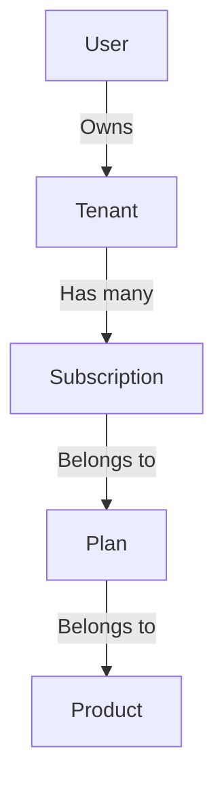
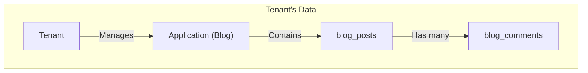

# Database Schema & Models Plan (Shared Hosting)

This document details the database models and relationships for the **Modular Monolith** architecture, designed for a shared hosting environment.

## Guiding Principles
1.  **Single Database**: All tables exist within one database.
2.  **Multi-Tenancy Scoping**: The `spatie/laravel-multitenancy` package will be used. Models that handle tenant-specific data will be "tenant-aware".
3.  **Modularity**: Tables belonging to a specific product module will be prefixed for clarity and to prevent name collisions (e.g., `blog_`).

---

## 1. Platform Core Models
These models form the core of the platform and are **NOT** tenant-aware. They manage the platform itself.

### `users`
Stores user accounts. A user can be an owner of a tenant or just a member.
- `id` (PK)
- `name` (string)
- `email` (string, unique)
- `password` (string)
- `timestamps`

### `tenants`
Represents a customer entity (an individual or a company). This is the central model for multi-tenancy.
- `id` (PK)
- `owner_id` (FK to `users.id`)
- `name` (string)
- `domain` (string, unique - for subdomain access, e.g., `my-company.mintreu.com`)
- `timestamps`

### `products`
The catalog of services offered by the platform (e.g., "Blog System", "E-commerce API").
- `id` (PK)
- `name` (string)
- `slug` (string, unique)
- `description` (text)
- `module_key` (string - e.g., `blog`, `ecommerce`. Used to identify the local package.)

### `plans`
Pricing tiers for each product.
- `id` (PK)
- `product_id` (FK to `products.id`)
- `name` (string - e.g., "Basic", "Pro")
- `price` (decimal)
- `billing_cycle` (enum: `monthly`, `yearly`)
- `features` (json)

### `subscriptions`
Links a `Tenant` to a `Plan`, activating a product for them.
- `id` (PK)
- `tenant_id` (FK to `tenants.id`)
- `plan_id` (FK to `plans.id`)
- `status` (enum: `active`, `cancelled`, `past_due`)
- `expires_at` (timestamp)
- `timestamps`

### Relationships (Platform Core)

---

## 2. Application & API Models
These models manage a Tenant's specific instance of a Product and its credentials.

### `applications` (Tenant-Aware)
An instance of a Product provisioned by a Tenant.
- `id` (PK)
- `tenant_id` (FK to `tenants.id`) - **TENANT SCOPE**
- `product_id` (FK to `products.id`)
- `name` (string - e.g., "My Personal Blog")
- `timestamps`

### `api_keys` (Tenant-Aware)
Credentials for an `Application` to access APIs.
- `id` (PK)
- `application_id` (FK to `applications.id`)
- `tenant_id` (FK to `tenants.id`) - **TENANT SCOPE**
- `key` (string, unique, indexed)
- `secret` (string, hashed)
- `last_used_at` (timestamp)
- `timestamps`

---

## 3. Module-Specific Models (Example: Blog Module)
These models belong to a specific product module (`/packages/Blog`). They are always **tenant-aware**.

### `blog_posts` (Tenant-Aware)
- `id` (PK)
- `tenant_id` (FK to `tenants.id`) - **TENANT SCOPE**
- `author_id` (FK to `users.id`)
- `title` (string)
- `slug` (string)
- `content` (longtext)
- `published_at` (timestamp, nullable)
- `timestamps`

### `blog_comments` (Tenant-Aware)
- `id` (PK)
- `tenant_id` (FK to `tenants.id`) - **TENANT SCOPE**
- `post_id` (FK to `blog_posts.id`)
- `author_id` (FK to `users.id`)
- `content` (text)
- `timestamps`

### Relationships (Blog Module)

When another module like "E-commerce" is added, it would have its own tenant-aware tables (`ecom_products`, `ecom_orders`, etc.), all residing in the same database but automatically segregated by the `tenant_id`.
